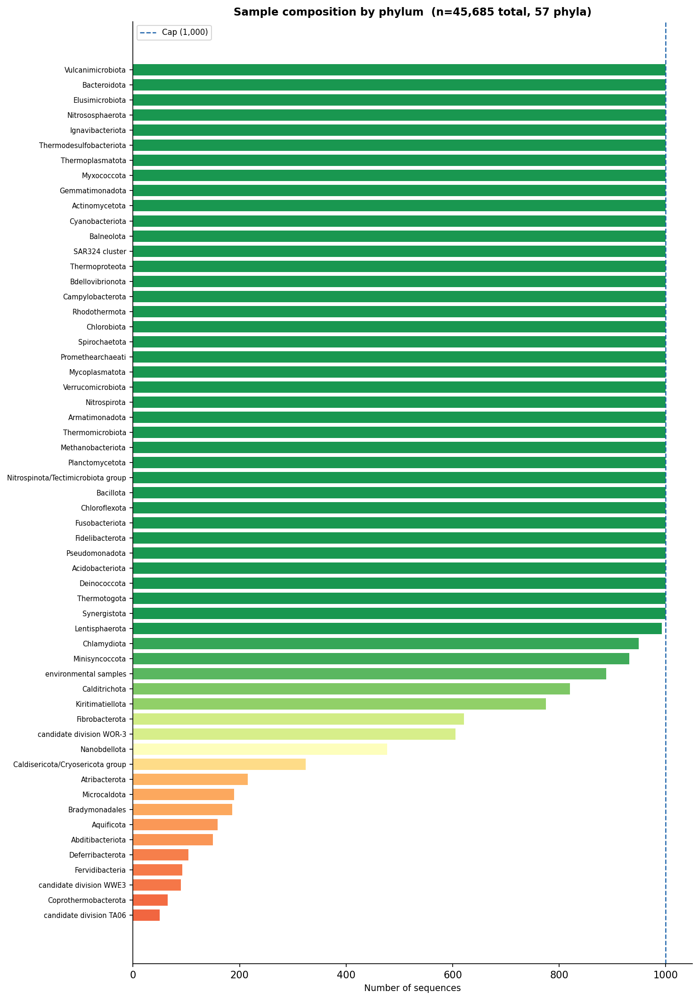
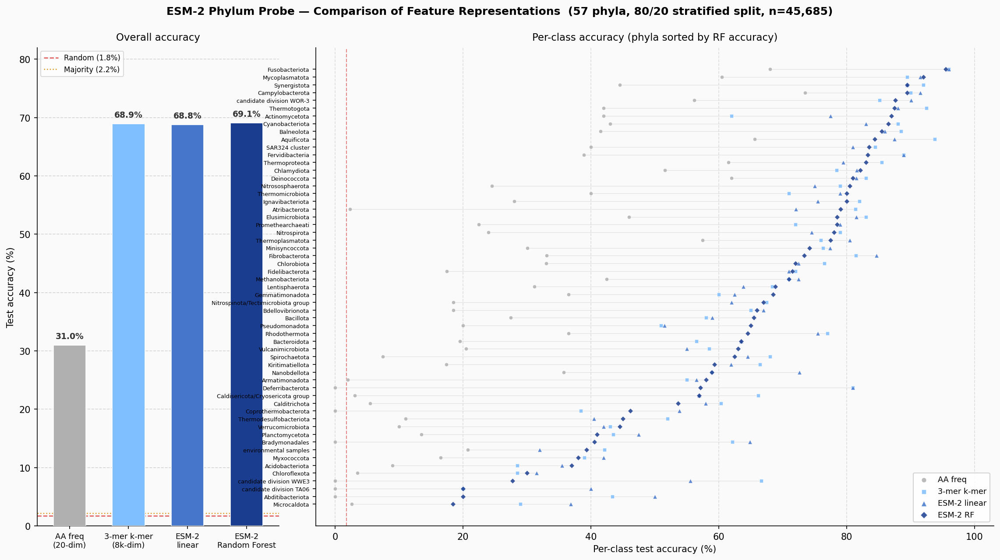
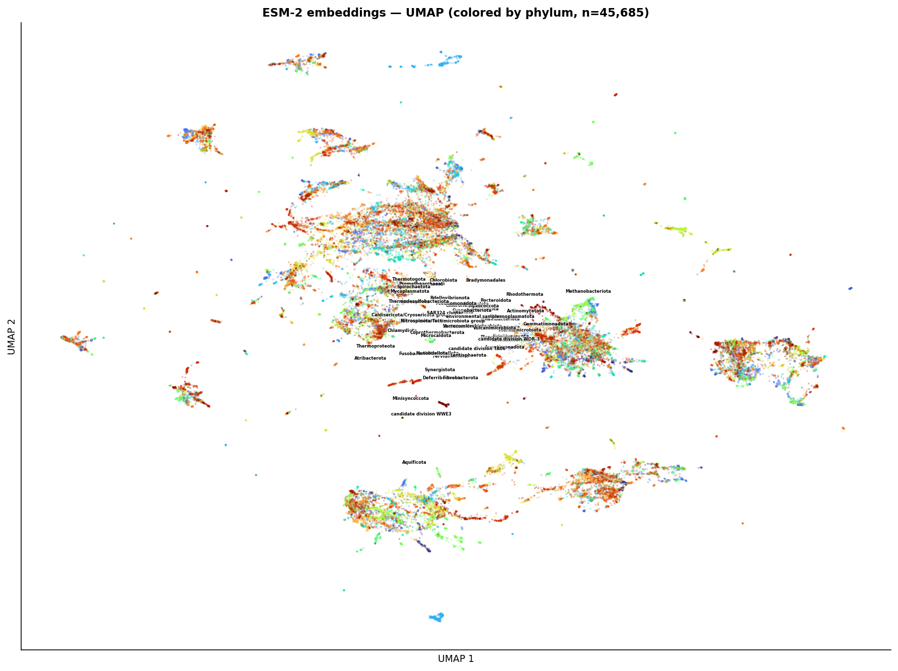
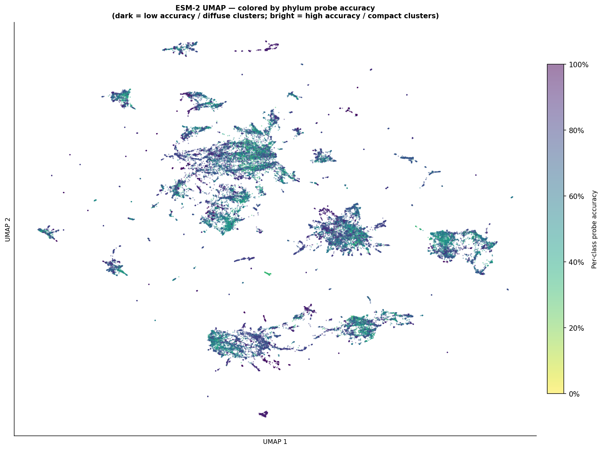
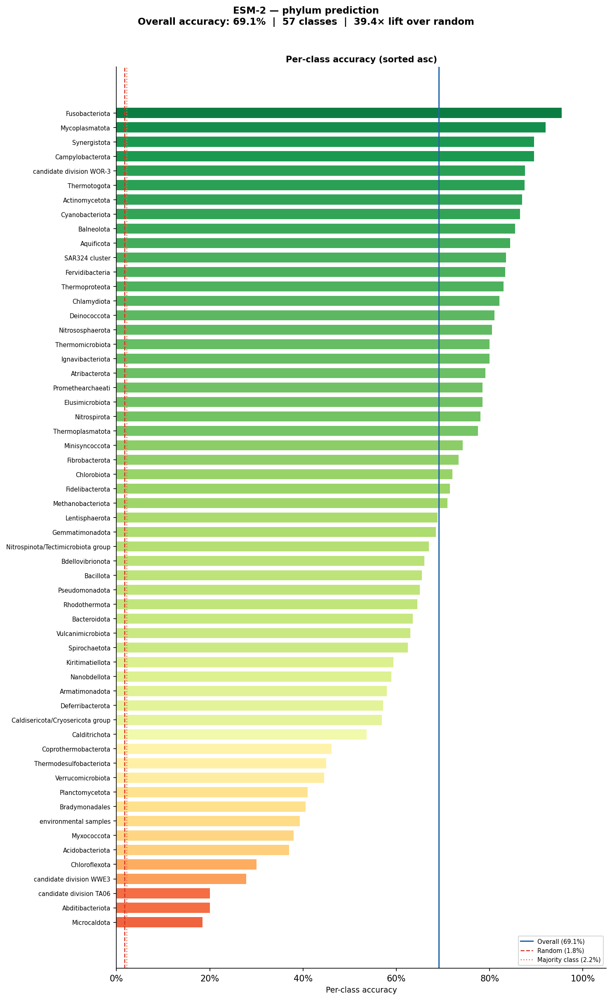
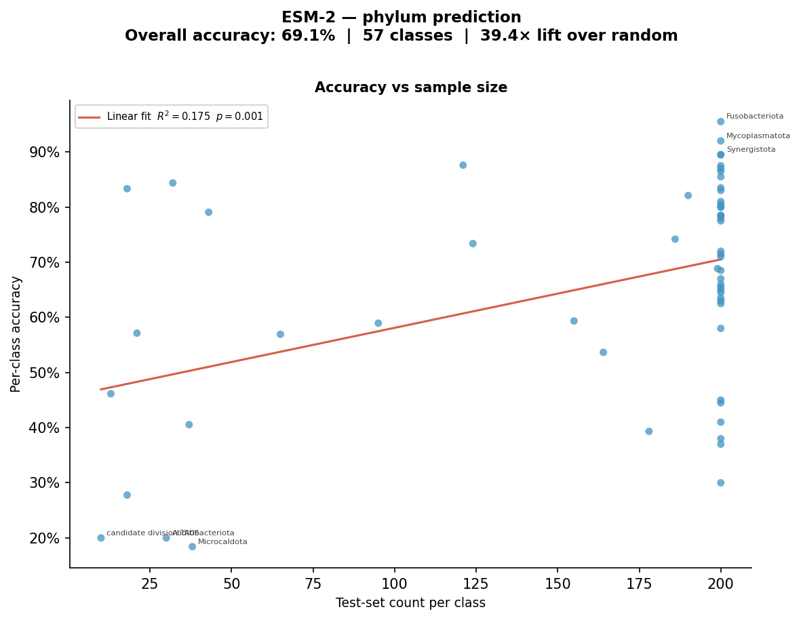
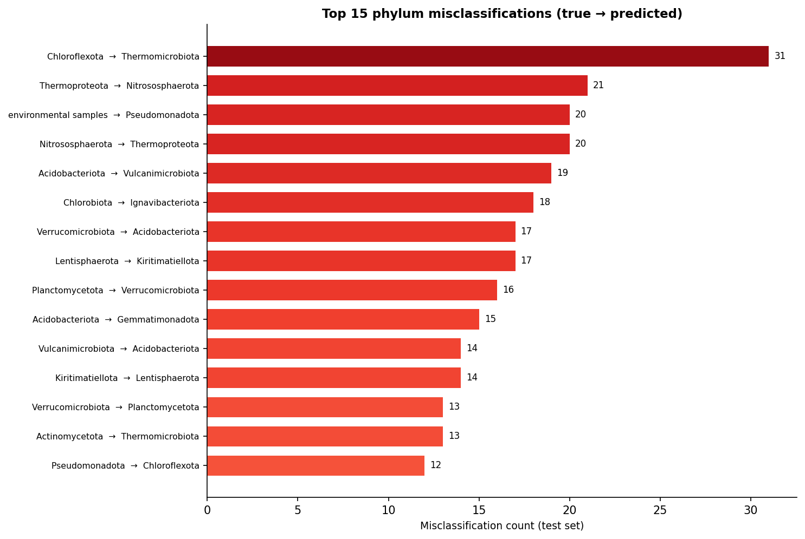

## BLAST-NR Metadata Signal Pilot — ESM-2 Phylum Probe

Lead     : `Pixel`

Start    : `2026-05-08`

Complete : `2026-05-21`

Files    : `~/Documents/projects/blastnr-metadata-pilot/` — local working directory

S3 files : `s3://petadex/esm_embeddings/blastnr_metadata_pilot/` — embeddings archive

---

### Data Accessed: 2026-05-08
```bash
# Source: PETadex NCBI variant sequences
# blast_nr_sample_seqs.csv — 2,735,612 sequences with metadata
# Sampled to 45,685 sequences via data_prep/sample_blast_nr.py

# Embeddings synced to S3 after generation:
aws s3 sync esm-embeddings/ s3://petadex/esm_embeddings/blastnr_metadata_pilot/ \
    --exclude "*" --include "*.npz" --include "*.csv"
```

## Introduction

PETadex maintains a database of 2.7 million NCBI variant protein sequences, each annotated with metadata fields including taxonomy, country, journal, and collection date. Before committing to a full embedding run on Azure ($80–180 in estimated compute), this pilot asks a more basic question: do ESM-2 embeddings carry meaningful biological signal as reflected by these metadata labels?

The experiment uses `esm2_t30_150M_UR50D` (150M parameters, 640-dimensional embeddings) as the encoder. A linear probe — logistic regression trained on frozen, mean-pooled embeddings — is the primary evaluation method. Probing is a standard representation-quality test: if a simple linear classifier can recover structured metadata from embeddings that were never trained on it, the encoder is capturing relevant biological variation. A nonlinear probe (random forest) was added to check whether the signal is linear or requires more complex decision boundaries.

Phylum was chosen as the target label. It is the coarsest taxonomic rank that is still meaningful for benchmarking representation quality: 57–58 classes, approximately balanced by design, with a well-understood biological interpretation. If phylum cannot be recovered from ESM-2 embeddings, finer-grained metadata signals (country, journal, collection date) are unlikely to be recoverable either. This is therefore a go/no-go gate for the full Azure embedding run.

## Objectives

1. Embed a stratified sample of BLAST-NR sequences with ESM-2 (`esm2_t30_150M_UR50D`).
2. Train a linear probe (logistic regression) and a nonlinear probe (random forest) on phylum labels using frozen embeddings.
3. Compare probe accuracy against biochemical composition baselines (amino acid frequency, 3-mer k-mer counts) to determine whether ESM-2 adds signal beyond raw composition.
4. Reach a go/no-go decision on the full 2.7M sequence Azure embedding run.

---

## Materials and Methods

### System

- **Hardware**: NVIDIA RTX 3070 (8 GB VRAM), local workstation
- **Model**: `facebook/esm2_t30_150M_UR50D` via HuggingFace `transformers`
- **Precision**: float16 mixed-precision inference
- **Probes**: scikit-learn (`LogisticRegression`, `RandomForestClassifier`)

### Sampling Design

The full 2.7M-sequence dataset is 90% Bacteria, 8.7% Eukaryota, 1.1% Archaea. For this pilot:

- **Scope**: Bacteria + Archaea only (91% of data). Eukaryota excluded due to variable NCBI rank positioning making clean phylum extraction unreliable.
- **Strategy**: Equal sampling per phylum rather than proportional, to ensure all phyla are evaluable. Proportional analysis is deferred to the full run.
- **Floor/cap**: Phyla with <50 sequences excluded entirely. Phyla with 50–999 sequences taken in full. Phyla with ≥1,000 sequences capped at 1,000.
- **Label normalisation**: `Proteobacteria` merged into `Pseudomonadota` (NCBI rename, 2021).
- **Phylum extraction**: NCBI lineage strings are semicolon-delimited. Some lineages insert a superclade between domain and phylum (e.g., `Bacteria; Pseudomonadati; Pseudomonadota; ...`). A known-superclade lookup handles this.

**Final sample**: 45,685 sequences across 58 phyla (37 capped at 1,000; 21 taken in full).



### Embedding Pipeline

```bash
# ~165 sequences/sec on RTX 3070, ~45 min total
# Output: esm-embeddings/chunk_XXXX.npz (5,000 seqs per chunk)
# Pooling: mean over real residue positions only (attention mask excludes padding, BOS, EOS)
```

Sanity checks (smoke test on 50 sequences):
- Output shape `(50, 640)` ✓
- No NaNs, no zero rows ✓
- Near-identical sequence pair: cosine = 1.0000 ✓
- Diverse sequence pair: cosine = 0.9231 ✓

### Train/Test Splits

80/20 stratified split by phylum via `probes/make_splits.py`: 36,548 train / 9,137 test.

### Probes

All probes evaluated on the same held-out test set for direct comparability.

| Probe | Script | Features | Model |
|---|---|---|---|
| AA frequency baseline | `probes/baseline_probes.py` | 20-dim amino acid frequency | L2 logistic regression |
| 3-mer k-mer baseline | `probes/baseline_probes.py` | 8,000-dim 3-mer frequency | L2 logistic regression |
| ESM-2 linear probe | `probes/esm2_probe.py` | 640-dim mean-pooled embedding | L2 logistic regression, StandardScaler |
| ESM-2 random forest | `probes/rf_probe.py` | 640-dim mean-pooled embedding | Random forest, 500 trees, seed 42 |

## Results & Discussion

### Probe Accuracy Comparison

**All probes substantially exceed baseline, clearing the go/no-go threshold of >50%.** However, the 3-mer k-mer baseline matches ESM-2 almost exactly, suggesting that phylum signal in this dataset is largely captured by amino acid composition rather than contextual sequence representations.

| Probe | Features | Accuracy | Lift over random |
|---|---|---|---|
| Random baseline | — | 1.75% (1/57) | 1.0× |
| Majority class baseline | — | 2.19% | 1.25× |
| AA frequency (linear) | 20-dim | 31.0% | 17.7× |
| ESM-2 linear probe | 640-dim | **68.8%** | 39.2× |
| 3-mer k-mer (linear) | 8,000-dim | **68.9%** | 39.3× |
| ESM-2 random forest | 640-dim | **69.1%** | 39.4× |

The jump from AA frequency (31.0%) to k-mer or ESM-2 (~69%) is substantial. The random forest over ESM-2 provides a negligible improvement (+0.3 pp) over the linear probe, indicating the embedding space is approximately linearly separable for this task.

**Critical finding**: the 3-mer k-mer baseline matches ESM-2 to within 0.2 pp. ESM-2's 150M learned parameters are encoding phylum signal primarily through composition, not higher-order contextual structure. Whether ESM-2 adds value for harder targets (country, journal, collection date) — where composition alone is less predictive — remains the key open question.



### Embedding Space

UMAP of all 45,685 ESM-2 embeddings reveals broad macro-structure: sequences cluster by phylum, with well-separated islands for distinctive phyla (e.g., Mycoplasmatota, Fusobacteriota, Thermotogota) and a dense central mass containing the more compositionally similar Bacteria.



Colouring the same UMAP by per-class probe accuracy shows that compact, isolated clusters correspond to high-accuracy phyla, while diffuse or overlapping regions correspond to low-accuracy phyla. The central mass — dominated by Pseudomonadota, Chloroflexota, Acidobacteriota, and Planctomycetota — is where most errors occur.



### Per-Class Accuracy

The random forest probe reaches >85% accuracy on 8 of the 57 phyla (Fusobacteriota 95.5%, Mycoplasmatota 92.0%, Campylobacterota and Synergistota 89.5%), while falling below 30% for four phyla — all of which are small classes (n ≤ 38 in the test set).

Two full-size classes stand out as genuinely hard: **Chloroflexota** (30.0%, n=200) and **Myxococcota** (38.0%, n=200). Their poor accuracy cannot be attributed to limited training data and likely reflects true compositional overlap with other phyla in embedding space.



Per-class accuracy scales weakly but significantly with test-set class size (R² = 0.175, p = 0.001), confirming that small classes are disproportionately hard. The effect is modest — most variance in per-class accuracy is driven by phylum identity, not sample size.



### Misclassification Patterns

The dominant misclassification (Chloroflexota → Thermomicrobiota, n=31) pairs two phyla known to share deep-branching thermophilic lineages. The Nitrososphaerota ↔ Thermoproteota confusion (20 errors in each direction) reflects their shared Archaeal domain — both are Thermoproteota-clade Archaea — and may partly be a label-noise artefact from the NCBI rank-position extraction heuristic. The `environmental samples` → Pseudomonadota leakage (n=20) is expected given that Pseudomonadota dominates the Bacteria and unresolved environmental sequences likely draw from it.



### Go / No-Go Decision

**Decision: GO.** The 69.1% overall accuracy (39.4× lift over random) comfortably clears the >50% gate defined in the experiment protocol.

However, the finding that 3-mer composition matches ESM-2 on phylum prediction reframes the next phase. The discriminating question is whether ESM-2 adds value on metadata fields where composition alone is weak:
- Country of collection
- Journal / database of origin
- Collection date

### Open Items

- **Azure quota**: Manual review pending — gating item for the full 2.7M sequence run.
- **`environmental samples` phylum**: Included in this pilot (n=178 test, 39.3% accuracy). Decision on exclusion deferred.
- **Class-level label noise**: Some position-[2] labels are class-level (e.g., Gammaproteobacteria, Bacilli). Accepted for pilot; cleaning deferred.
- **Eukaryota**: Excluded due to variable NCBI rank depth. Strategy for inclusion in full run undefined.
- **Harder probes**: Country, journal, collection date probes not yet run.

### Follow-up Questions

- Does ESM-2 outperform 3-mer k-mer on country / journal / collection date prediction?
- Do Chloroflexota and Myxococcota confusion patterns correspond to known evolutionary relationships, or are they artefacts of the sampling/label noise?
- Would a sub-phylum probe (class or order level) show a larger gap between ESM-2 and composition baselines, as finer ranks require more contextual signal?
