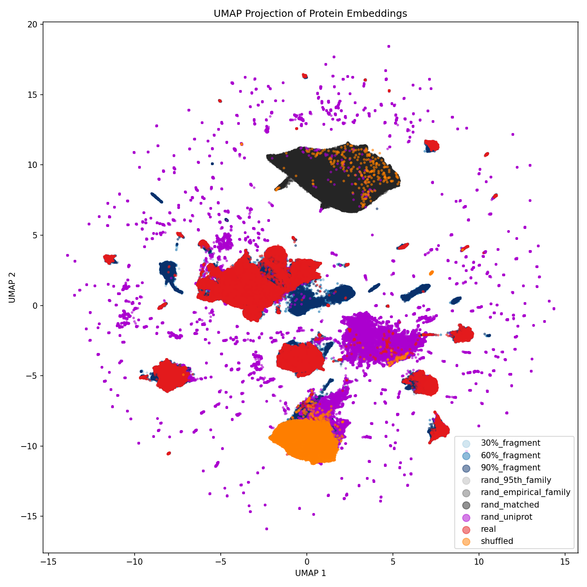
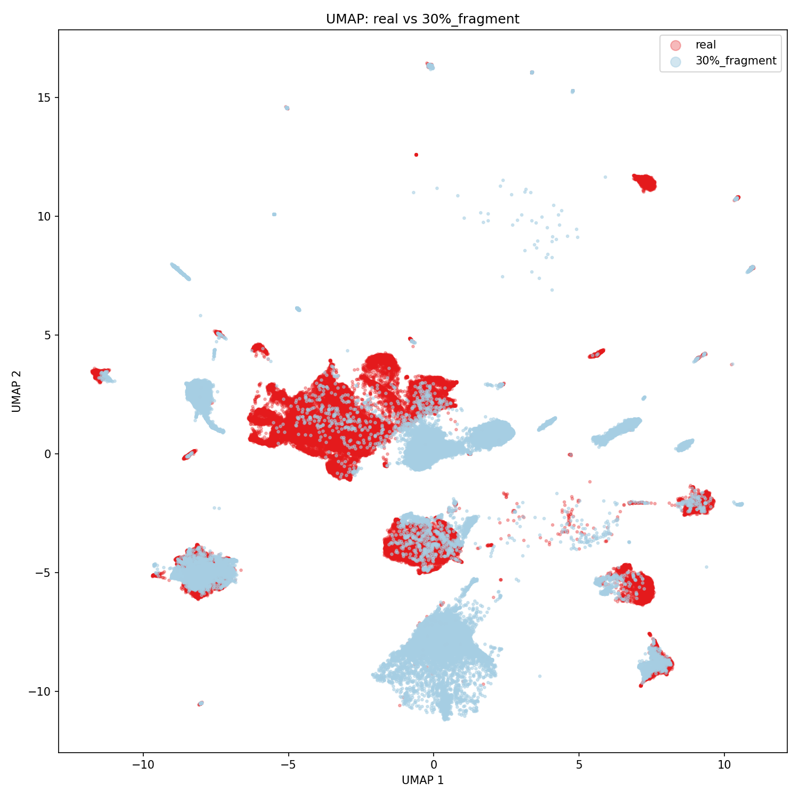
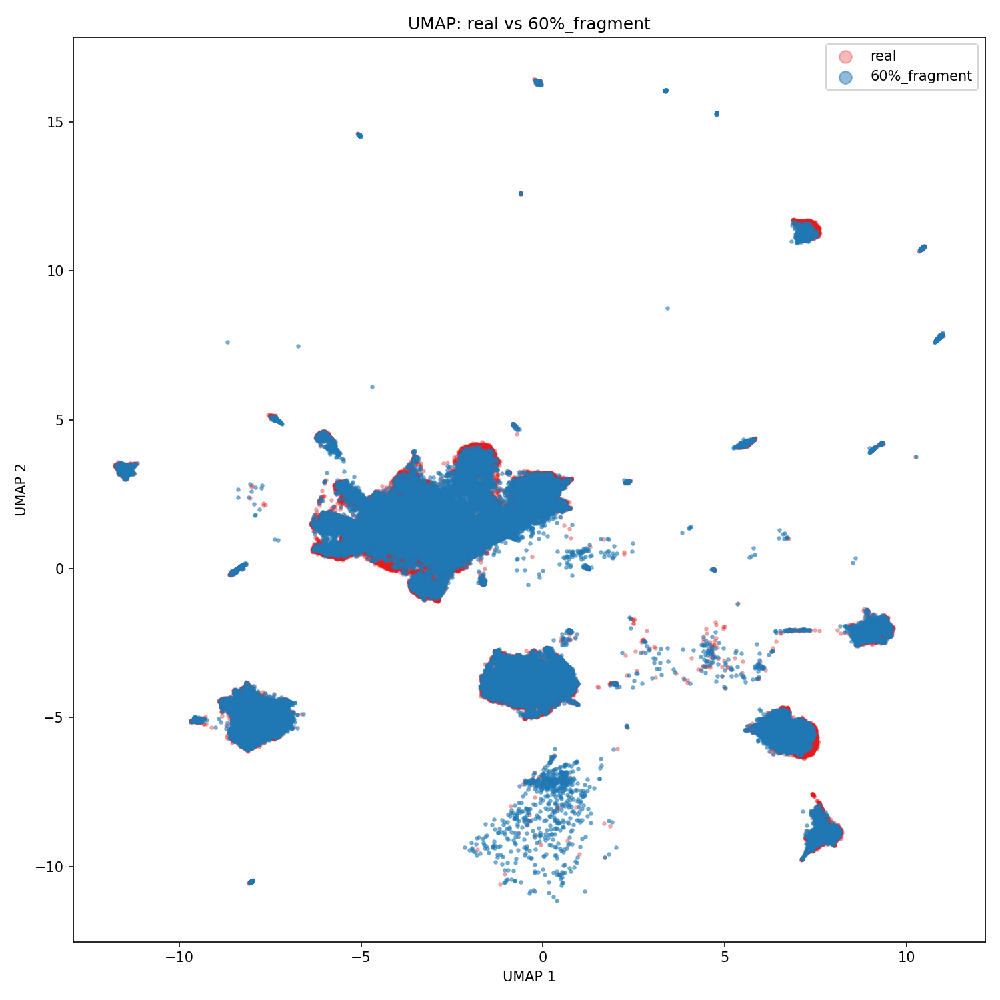
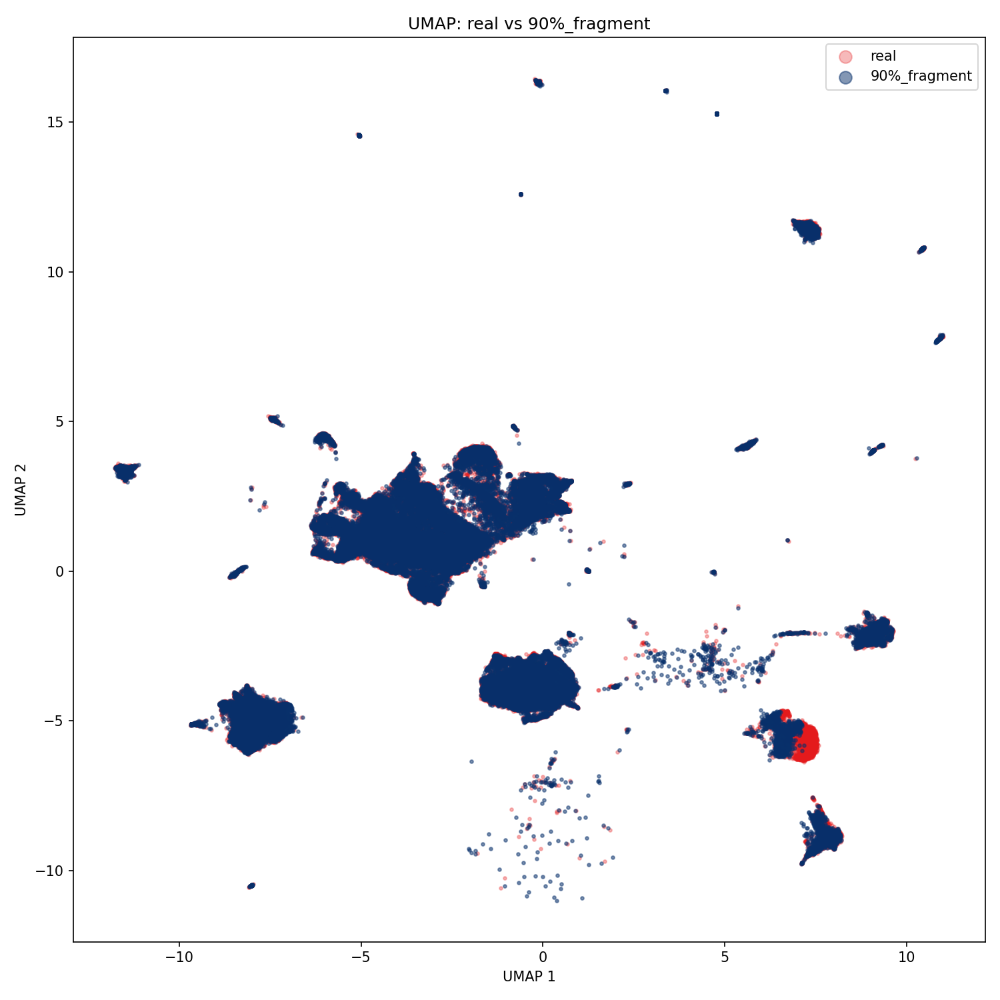
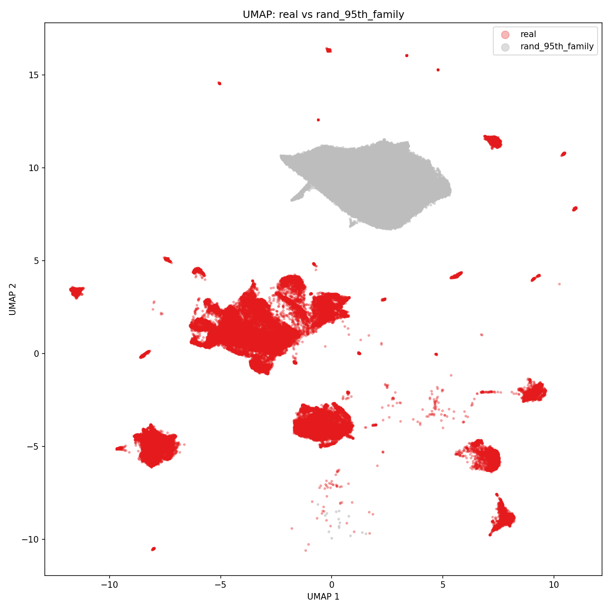
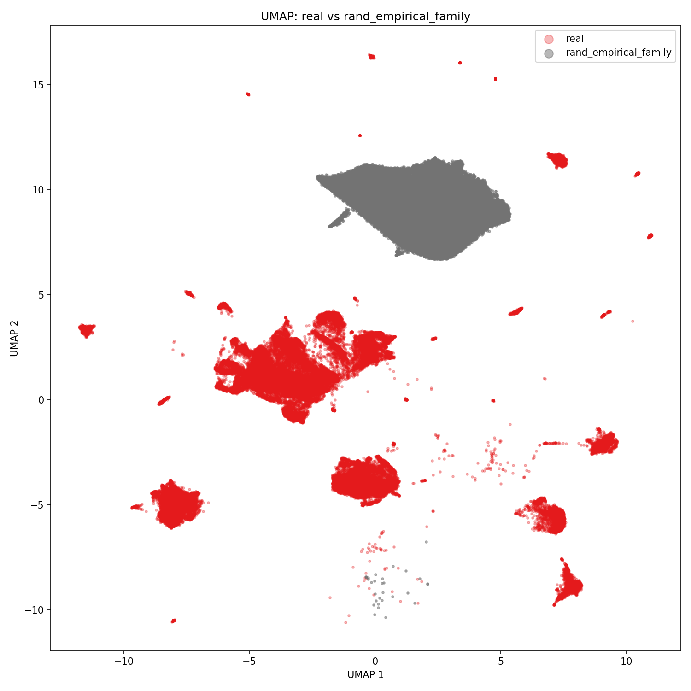
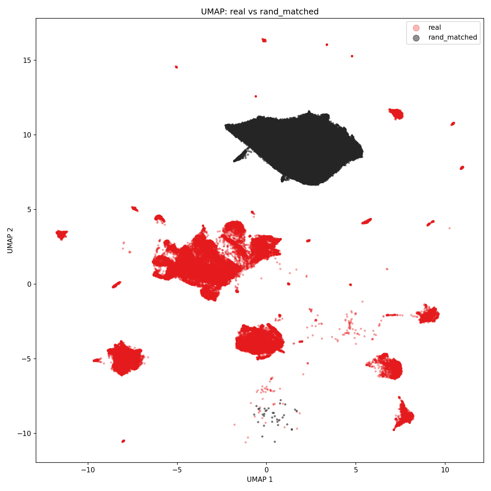
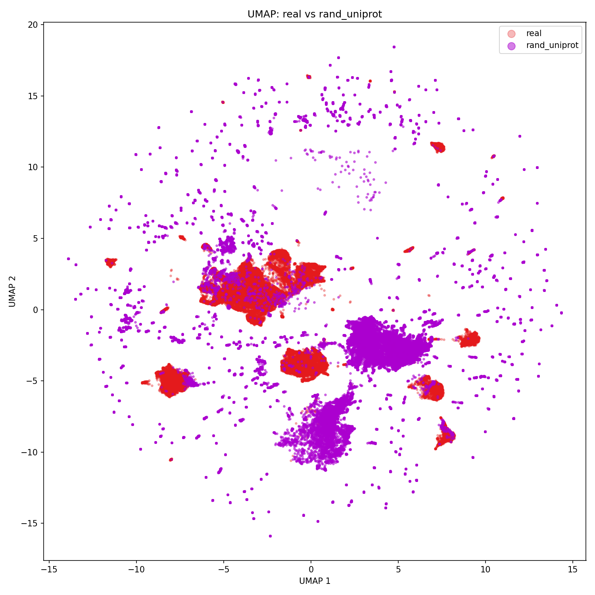
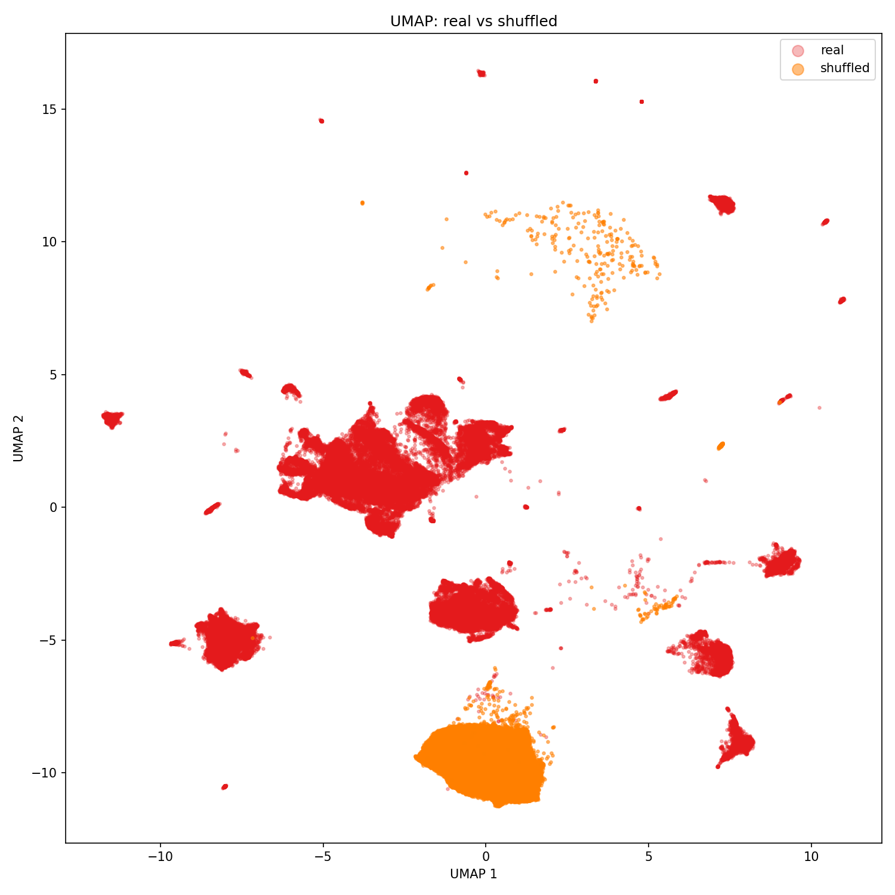

## ESM Landscape Controls

Lead     : `Oscar Heath / baleinegris`

Issue    : [Github Issue #78](https://github.com/petadex/igem-toronto/issues/34) — _Umap Control Analysis_

Start    : `2026-05-30`

Complete : `2026-05-30`

Files    : `~/resources/260530_issue_78_umap_control_analysis/` — control plotting scripts

## Introduction
In this project we expand on the work of [#75 (ESM Controls UMAP)](https://github.com/petadex/igem-toronto/issues/75), further analysing the UMAP controls, with an emphasis on the fragments. 

## Objectives
We aim to look at all of the controls in more detail by isolating them to separate plots, split the fragments into the 30%, 60% and 90% versions and analyse where they map relative to their origin sequence. Specifically, we calculate the average distance between samples, then compare this with the average distance between fragment and origin, for 30%, 60%, and 90%.

## Methods
- **Reducer**: `umap-learn`, `n_neighbors=15`, `min_dist=0.1`, `metric=euclidean`, `random_state=42`.

### Data Accessed 2026-05-30
```bash
https://petadexstorage.blob.core.windows.net/esm-embeddings/family_embedding_controls.esm2-150M.d640.n517840.npz
https://petadexstorage.blob.core.windows.net/esm-embeddings/family_embeddings.esm2-150M.d640.n64730.npz
```

## Results

<table>
<tr>
  <td></td>
  <td></td>
  <td></td>
</tr>
<tr>
  <td></td>
  <td></td>
  <td></td>
</tr>
<tr>
  <td></td>
  <td></td>
  <td></td>
</tr>
</table>

## Discussion

For the controls generally, we find the same results as [#75 (ESM Controls UMAP)](https://github.com/petadex/igem-toronto/issues/75), with the shuffled sequences and random/matched/empirical forming their own "junkyard" regions, Uniprot embeddings being scattered randomly, and fragments hugging the real data closely. Analysing the fragment plots more carefully, we see:
- **The 30% fragments lose a lot of signal**: These fragments are generally far from the real data, and many of them land in the "shuffled junkyard region", meaning their embedding is likely picking up mostly amino acid composition, and not meaningful structural data
- **The 60% and 90% fragments are much better**: These fragments are mapped closely to their origin sequence in the UMAP, with some still falling in the shuffled junkyard region


### Distance Analysis
Despite UMAP distances not being super meaningful, we analyzed the average distance between real samples in the UMAP, and compared it to the average distance between fragment and origin:

```
Average pairwise distance (sample n=5000): 7.7443
Average matched distance (30%_fragment vs real): 6.9154  (std: 4.9091)
Average matched distance (60%_fragment vs real): 0.6246  (std: 1.7473)
Average matched distance (90%_fragment vs real): 0.1632  (std: 0.7398)
```

As we can see, the fragments get mapped closer to their origin sequence than different real samples to each other


```python

```


```python

```
