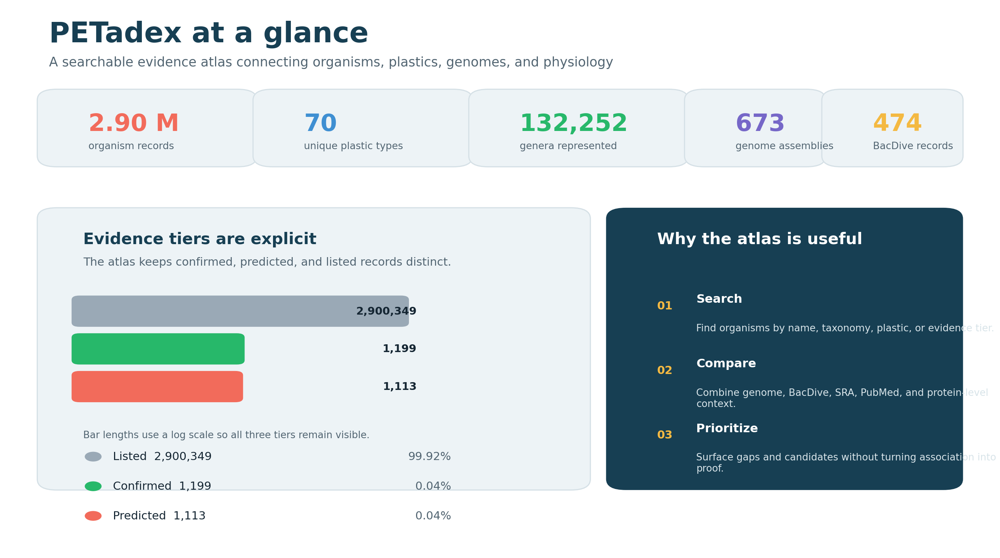
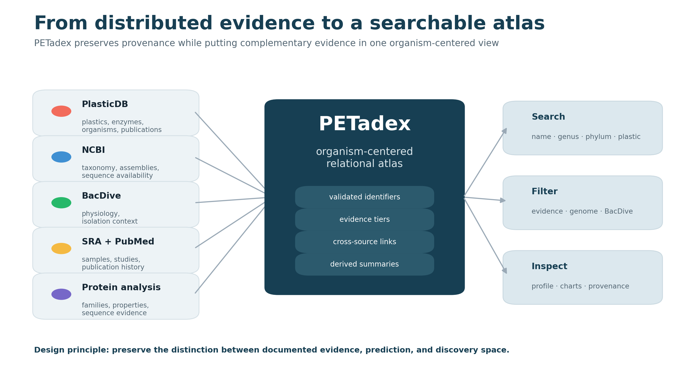
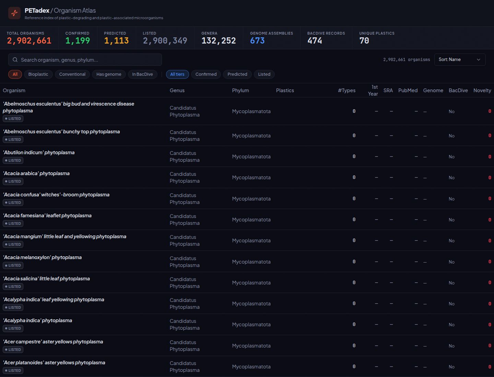
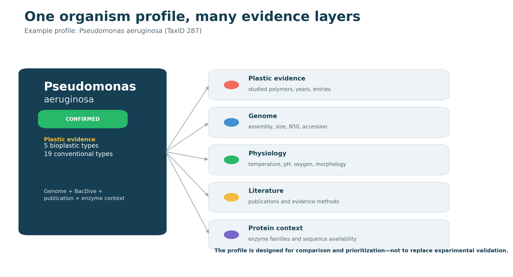
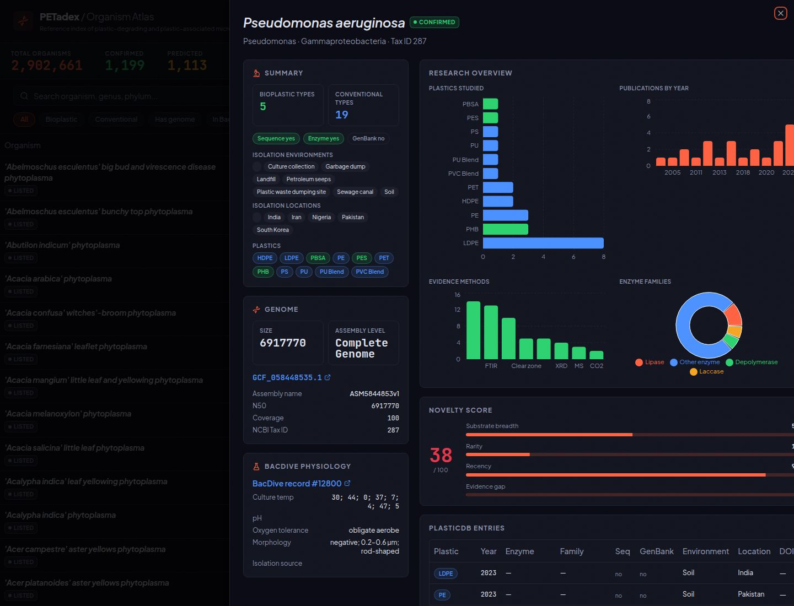
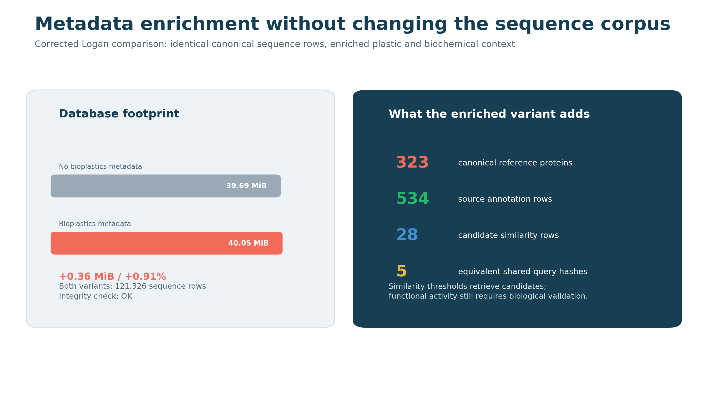

# PETadex: a searchable atlas of putative plastic-degrading enzymes and organisms

**Poster subtitle:** Connecting plastic evidence, protein sequences, taxonomy, genomes, physiology, and literature at scale.

**One-sentence takeaway:** PETadex converts fragmented plastic-biodegradation evidence into a searchable, organism-centered atlas while keeping confirmed observations, predictions, and discovery candidates distinct.

---

## Column 1 — Why PETadex?

### The plastic-biodegradation evidence gap

Plastic-associated enzymes and microorganisms are reported across specialized databases, sequence archives, taxonomic resources, physiological collections, and individual publications. Differences in names, identifiers, evidence standards, and metadata make these records difficult to compare or reuse.

### Our approach

PETadex links PlasticDB records with NCBI taxonomy and genome assemblies, BacDive physiology, SRA studies, PubMed literature, protein-family annotations, sequence availability, and calculated biochemical properties. The resulting Atlas organizes approximately **2.90 million organisms**, **132,252 genera**, and **70 plastic types** in one searchable interface.

### Evidence remains explicit

Records are separated into:

- **Confirmed:** direct evidence recorded in the source literature or database.
- **Predicted:** computationally inferred association.
- **Listed:** taxonomic search space without a claim of plastic-degrading activity.

This separation lets PETadex broaden discovery without turning association into proof.

**Figure 1. PETadex scale and evidence tiers.** The Atlas combines a large taxonomic search space with smaller, explicitly labeled confirmed and predicted subsets. Bar lengths use a logarithmic scale so all tiers remain visible.

---

## Column 2 — Building and using the Atlas

### An organism-centered data model

PETadex preserves source provenance while connecting complementary evidence around a stable organism identity. Validation checks cover TaxIDs, organism names, JSON fields, duplicate records, orphaned links, and database integrity.

**Figure 2. From distributed evidence to a searchable Atlas.** PlasticDB, NCBI, BacDive, SRA, PubMed, and protein analyses are integrated into validated organism profiles with cross-source provenance.

### Search and compare

Researchers can:

- Search by organism, genus, phylum, or plastic.
- Filter by evidence tier, plastic class, genome availability, or BacDive coverage.
- Sort and paginate across approximately 2.90 million records.
- Compare plastics studied, evidence methods, publication history, genome statistics, isolation context, enzyme families, and sequence availability.

**Figure 3. Organism Atlas overview.** Search, filters, evidence tiers, taxonomic fields, research indicators, and novelty scores are available in one high-density table.

### From search result to evidence profile

Each organism profile combines plastic records with genomic, physiological, bibliographic, and protein-level context. A novelty score summarizes substrate breadth, rarity, recency, and evidence gaps for prioritization; it is not a measure of experimentally validated activity.

**Figure 4. Evidence layers in an organism profile.** The *Pseudomonas aeruginosa* profile illustrates how plastic associations are placed alongside genome, physiology, literature, and protein evidence.

**Figure 5. Enriched profile view.** The interface displays plastics studied, publication trends, evidence methods, enzyme families, genome metadata, BacDive physiology, novelty scoring, and source records.

---

## Column 3 — Planetary-scale sequence screening

### Connecting Logan and PETadex

We tested whether plastic and biochemical metadata could be added to a Logan sequence database without changing its canonical sequence corpus. Nine Logan runs contributed **121,326 sequence records** and **18,020,607 bases**. The enriched variant added:

- **323** canonical PlasticDB/PAZy reference proteins.
- **534** source-specific annotation rows.
- Plastic and enzyme-family classifications.
- ProtParam biochemical properties.
- Study context and source provenance.
- DIAMOND translated sequence-similarity candidates.

**Figure 6. Metadata enrichment benchmark.** Both database variants contain identical canonical sequence rows. Adding the reference, biochemical, similarity, and provenance layers increased storage from **39.69 MiB to 40.05 MiB**—an overhead of approximately **0.91%**.

### Candidate similarities, not functional predictions

The DIAMOND screen used a permissive candidate-retrieval threshold:

- E-value ≤ **1 × 10⁻⁵**
- Amino-acid identity ≥ **30%**
- Aligned length ≥ **50 aa**
- Reference coverage ≥ **50%**

The screen returned **28 similarity rows affecting 18 Logan sequences**. All occurred in background-control runs; none occurred in the three microplastic-context runs. Study context and molecular similarity therefore remain separate evidence dimensions.

Pipeline controls recovered **25/25 exact encoded references**, while **0/25 shuffled artificial decoys** passed the candidate threshold. These controls verify pipeline operation, not biological sensitivity or specificity.

### Conclusions

1. PETadex makes heterogeneous plastic-biodegradation evidence searchable at organism scale.
2. Explicit evidence tiers support broad discovery without overstating confidence.
3. Organism profiles connect plastic records to genome, physiology, literature, and protein context.
4. Bioplastics metadata can be added to a Logan sequence database with identical canonical sequences and less than 1% storage overhead in this benchmark.
5. Homology results identify candidates for follow-up; experimental validation is required before claiming plastic-degrading function.

---

## Compact poster callouts

Use these as large-number cards:

- **2.90 M** organism records
- **70** plastic types
- **132,252** genera
- **323** canonical reference proteins
- **121,326** benchmark sequence records
- **0.91%** metadata storage overhead
- **25/25** exact pipeline controls recovered
- **0/25** shuffled decoys passing threshold

## Suggested placement in the supplied poster layout

- **Left column:** Figures 1 and 2 with “Why PETadex?” and the evidence-tier definitions.
- **Center column:** Figures 3–5 with the search, comparison, and profile text.
- **Right column:** Figure 6 with the Logan benchmark, candidate-screen limitations, and conclusions.
- Keep captions to two lines at final print size; move detailed methods and provenance to a QR-linked supplement if space is limited.

## Data sources and reproducibility

Primary sources include PlasticDB, PAZy, NCBI Taxonomy and Assembly, BacDive, SRA/ENA, PubMed, UniProt, Logan, and PETadex-derived protein analyses. Executed benchmark notebooks, source manifests, file hashes, query plans, classification audits, and control results are retained in `logan-database-benchmarks/`.