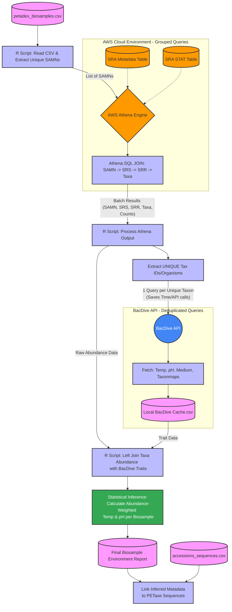

# Execution Plan: Automated Metadata & BacDive Integration

This document outlines the detailed execution plan for **Issue #28: Automated Metadata**. The objective is to cross-reference SRA accession codes with environmental databases (NCBI SRAstat/Athena and BacDive) to automatically fill in the blank pH and temperature values for the millions of Logan sequences.



---

## Stage 1: SRA-to-Taxonomy Mapping (AWS Athena)

The input file `petadex_biosamples.csv` contains **6.81 million** unique BioSample accessions (`SAMN...`). To associate these with specific organisms and their abundances:

1. **Query Engine**: Use the AWS Athena engine over the mirrored NCBI databases.
2. **SQL JOIN Query**:
   ```sql
   SELECT 
       meta.biosample AS biosample,
       meta.acc AS run_id,
       stat.taxon_id AS taxon_id,
       stat.scientific_name AS scientific_name,
       stat.read_count AS read_count
   FROM 
       sra_metadata meta
   JOIN 
       sra_stat stat ON meta.acc = stat.acc
   WHERE 
       meta.biosample IN (SELECT biosample FROM petadex_biosamples);
   ```
3. **Partitioning Strategy**: Since the tables are massive, split queries by BioSample prefix (e.g., `SAMN00`, `SAMN01`, ...) to prevent query timeouts and handle resource limits on Athena.

---

## Stage 2: Database Organism Table Design

We will build a normalized table `organism` in the PostgreSQL database. This allows us to display detailed pages for each organism on the website and link to external databases.

```sql
CREATE TABLE organism (
    taxon_id INT PRIMARY KEY,
    scientific_name VARCHAR(255) NOT NULL,
    tax_rank VARCHAR(50),
    lineage TEXT,
    bacdive_id INT,
    bacdive_url VARCHAR(255),
    temp_optimum_c NUMERIC,
    temp_range_min_c NUMERIC,
    temp_range_max_c NUMERIC,
    ph_optimum NUMERIC,
    ph_range_min NUMERIC,
    ph_range_max NUMERIC,
    oxygen_tolerance VARCHAR(100),
    created_at TIMESTAMP DEFAULT CURRENT_TIMESTAMP
);
```

---

## Stage 3: BacDive API Querying & Local Caching

To avoid hitting rate limits and causing high latency during API queries:

1. **Extract Unique TaxIDs**: Extract the unique TaxIDs from the SRA mapping results (typically ~50,000 unique TaxIDs out of 6.8 million BioSamples).
2. **Deduplicated API Calls**: Use a python script (`query_bacdive_api.py`) to query the BacDive API endpoint sequentially:
   - Endpoint: `https://bacdive.dsmz.de/api/tps/`
   - Retrieve: Physiological parameters (growth temperature, growth pH, growth media composition).
3. **Caching**: Store retrieved JSON responses in a local CSV file `local_bacdive_cache.csv` to allow offline processing and reuse across dry lab members.

---

## Stage 4: Statistical Trait Propagation

Since metagenomes contain a mix of diverse species (including transient, dead, or contaminating organisms), we use statistical aggregation to infer the true environmental conditions:

1. **Relative Abundance calculation**:
   $$P_{ij} = \frac{C_{ij}}{\sum_k C_{ik}}$$
   Where $C_{ij}$ is the read count of taxon $j$ in BioSample $i$.
2. **Trait Propagation**:
   - Filter out low-abundance taxons (e.g., relative abundance $< 0.5\%$).
   - Identify host-associated contaminating taxa (e.g. human gut microbes) and remove them when evaluating environmental metagenomes to prevent temperature bias.
3. **Abundance-Weighted Calculations**:
   - **Weighted Mean Temperature**:
     $$T_i = \sum_j (P_{ij} \times \text{temp\_optimum}_j)$$
   - **Weighted Median & IQR**:
     Calculate the cumulative distribution function of traits across taxa in the sample and extract the 25th, 50th (median), and 75th percentiles.
   - **Confidence Score**:
     Compute a confidence score based on the proportion of reads mapped to taxa with known BacDive entries, and the IQR width:
     $$\text{Confidence}_i = \frac{\sum_{j \in \text{Known}} P_{ij}}{1 + \text{IQR}_i(T)}$$

---

## Stage 5: Linking to PETase Candidate Sequences

Once environmental profiles are established for each BioSample, we link them back to the sequences in `accessions_sequences.csv`:

1. Map GenBank accession IDs in `accessions_sequences.csv` to the SRA runs they were found in.
2. Join these SRA runs to their BioSamples, and assign the inferred temperature, pH, and media traits.
3. Export the final sequence-to-environment mapping to the PostgreSQL database table `sequence_metadata_propagation`.

---

## Stage 6: Database & UI Integration

- **SQL Dump**: Expose the processed tables in `petadex.sql` for downstream ML models (e.g. Dennis's temperature/thermostability predictor).
- **Website UI (Sara)**: Design the "Organism" page templates showing:
  - Organism name, TaxID, Taxonomy.
  - Linked BacDive external page.
  - Culture conditions (temp, pH, media).
  - A list of PETase candidates identified in samples containing this organism.
