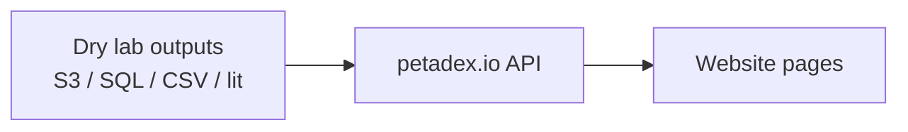

# Sara: PETadex website integration

Index of website work that wires dry lab outputs onto [petadex.net](https://petadex.net) / [petadex.io](https://github.com/petadex/petadex.io).

**Workflow issue:** [petadex/igem-toronto#97](https://github.com/petadex/igem-toronto/issues/97)

**App code:** https://github.com/petadex/petadex.io (my fork: https://github.com/sarapr06/petadex.io)

Thomas’s dry lab note listed me as the person who puts other people’s data on the website. This folder is that record, plus a few helper scripts. It does **not** copy the website codebase.

## How the pieces connect

Typical loop:

1. Someone ships data (S3 path, CSV, SQL table, notebook result).
2. Confirm the public URL or API shape (and ACL if S3).
3. Wire resolve + UI on petadex.io.
4. Open a PR on the fork; rebase onto upstream when needed.
5. Log it on issue #97 and here.

## Themes

| Folder | What it covers | Related issues |
|--------|----------------|----------------|
| [cath_domain_pages/](cath_domain_pages/) | CATH / Pfam pages, lit, HMMs, inline Mol* | #55, #54, #65 |
| [sequence_and_structure_viewers/](sequence_and_structure_viewers/) | Sequence tracks, Mol* annotations, SignalP, catalytic domains | #54, #65, #56 |
| [phylo_tree_navigation/](phylo_tree_navigation/) | Family trees: search, highlight from results, nav tools | website 2026 |
| [alex_esmfold2_folding_viewer/](alex_esmfold2_folding_viewer/) | Alex predicted folds + metrics on ORF pages | website 2026 |
| [sra_biosample_bacdive/](sra_biosample_bacdive/) | SRA / BioSample / organism hubs + BacDive means | #28 |
| [figures/](figures/) | Screenshot checklist (drop PNGs here when you capture them) | |
| [scripts/](scripts/) | S3 ACL probe for structure lanes | |

## Screenshots

See [figures/README.md](figures/README.md). Captions are written; add the PNGs when you grab them from a local run.

## Blockers (as of Aug 2026)

- **Dennis:** public GET on `esmfold2-centroids/60pid/` and `…/60pid-msa/` (same ACL as `test2`)
- **Purav:** full folds before Exp. figures beside the Folding Viewer
- **Denis:** BacDive CSV #1 / #2 / #2.5 not published yet (#3 is wired)
- **Angela / Thomas:** DeepLoc + biochem tables; ancestral AA after Thomas runs her jobs

## Related fork branches

- `feat/alex-structure-msa-lanes`
- `feat/denis-bacdive-biosample-means`
- `feat/cath-inline-molstar`
- `feat/angela-sequence-annotations`
- `feat/phylo-tree-navigation` / `proto/phylo-cluster-trees`
