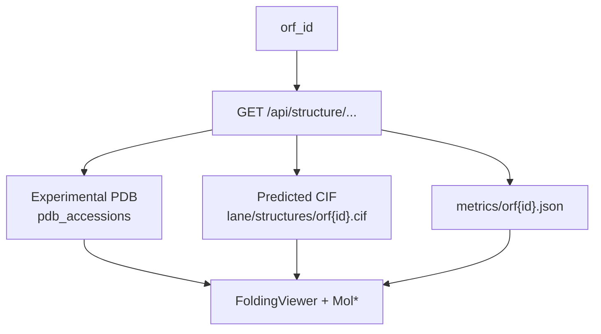

# Alex ESMFold2 Folding Viewer

## Goal

Show predicted 3D folds (and confidence metrics) on ORF / family / cluster pages using Alex’s S3 layout under `s3://petadex-protein-structures/`, without listing millions of keys.

## What users see

- Folding Viewer on ORF sequence (and related pages) when a CIF is publicly readable
- Confidence table, per-residue pLDDT, PAE heatmap
- Base / **MSA** toggle when that lane is configured and the file exists

## How data flows



**Alex layout (confirmed):**

- `{lane}/structures/orf{id}.cif`
- `{lane}/metrics/orf{id}.json`
- Demo lane (public): `esmfold2-centroids/test2`
- Production: `esmfold2-centroids/60pid` (403 as of Aug 2026)
- MSA experimental: `esmfold2-centroids/60pid-msa` (path confirmed; still 403)

## What I shipped (Jul–Aug 2026)

Branch: `feat/alex-structure-msa-lanes` (and earlier structure wiring).

1. Resolve API — experimental PDB first, else predicted CIF if Range GET works.
2. Metrics parse (mean_plddt, ptm, per-residue pLDDT, PAE); CIF B-factors match pLDDT.
3. UI: FoldingViewer via StructurePanel; Base / MSA toggle (renamed from “finetune”).
4. Localhost CORS: CIF via `GET /api/structure/content/orf/:orfId` proxy.
5. Verified sample: ORF **4981589** on `test2`.

Probe script: `../scripts/probe_structure_s3.sh`.

## Key files (petadex.io)

- `backend/src/routes/structure.js`
- `frontend/src/components/.../FoldingViewer.jsx` (and StructurePanel wiring)
- `frontend/docs/protein-structures.md` (if present on branch)

## How to check

```bash
./resources/260801_issue97_website_integration/scripts/probe_structure_s3.sh 4981589
```

Expect `test2` readable; `60pid` / `60pid-msa` 403 until ACL opens. Also hit `GET /api/structure/orf/4981589` and `/sequence/orf/4981589`.

## Blocked

- **Dennis:** public GET on `60pid` and `60pid-msa` (Alex can’t change ACL).
- **Purav:** full folds before Exp. figures beside the viewer.
- After ACL: set `STRUCTURE_S3_LANE=esmfold2-centroids/60pid` and `STRUCTURE_S3_MSA_LANE=esmfold2-centroids/60pid-msa`.

## Screenshot

- `figures/folding-viewer-orf.png` — see [figures/README.md](../figures/README.md).
