# CATH domain pages

## Goal

Each curated CATH / Pfam-style domain gets a site page with literature, figures, HMMs, and a structure view, linked out to atlas and enzyme pages.

Related: [#55](https://github.com/petadex/igem-toronto/issues/55), [#54](https://github.com/petadex/igem-toronto/issues/54), [#65](https://github.com/petadex/igem-toronto/issues/65).

## What users see

- Domain profile (summary, lit sections, figures under `frontend/static/cath/`)
- Live family count when the Pfam is mapped to an atlas `component`
- Links to `/atlas?component=N` and `/enzymes?component=N`
- In-page Mol* for PDB IDs on the profile (not an iframe to molstar.org)

## How data flows

```mermaid
flowchart TD
  Catalog["cathDomainCatalog.js\nPfam narratives + pdbIds"]
  Atlas["GET /api/atlas/components\ncomponent, cath_domain, family_count"]
  Page["/cath-domains"]
  Mol["ProteinViewer\nRCSB PDB download"]
  Catalog --> Page
  Atlas --> Page
  Page --> Mol
```

Only a few Pfams are mapped to atlas components today (see `pfamAtlasMap.js`). Unmapped profiles still show lit; they just won’t get a live family count.

## What I shipped (Apr–Jul 2026)

1. **Skeleton + lit** — CATH section, Pfam narrative/figures, atlas deep links, citation tooling.
2. **Catalog tooling** — HMM download/logos, architecture diagrams, cross-links.
3. **Citation fixes** — order validation (PF01425, PF01083, PF09995); DOI canonicalization; `build:validate-cath` green for all 23 profiles.
4. **Inline Mol*** — branch `feat/cath-inline-molstar`: PDB picker, RCSB download, in-page viewer.

## Key files (petadex.io)

- `frontend/src/pages/cath-domains.js`
- `frontend/src/components/cath/*`
- `frontend/src/data/cathDomainCatalog.js`, `pfamAtlasMap.js`
- `frontend/src/components/protein/ProteinViewer.js`

## How to check

1. Open `/cath-domains` and pick a profile with `pdbIds`.
2. Structure should load in-page; multi-PDB dropdown should switch models.
3. If the Pfam is mapped, family count should match `/api/atlas/components`.

## Blocked / follow-ups

- More domain writeups as Lisa / others finish them.
- Optional later: Alex predicted CIFs where ORF mapping is clean.

## Screenshot

- `figures/cath-inline-molstar.png` — domain page with Mol* loaded (see [figures/README.md](../figures/README.md)).
