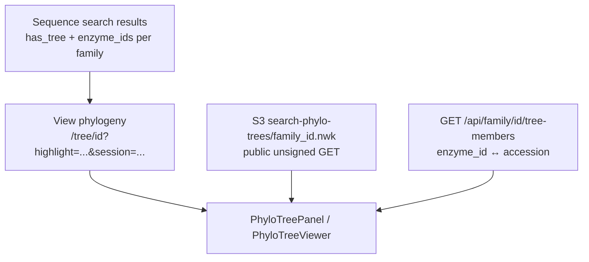

# Phylo tree navigation

## Goal

Make family phylogenetic trees usable on the site: find a tip, see where it sits relative to a search, inspect neighbors, narrow to a local region, and color leaves by metadata.

Dry lab asked for tools on the **existing** tree panel — not a separate stack.

## What users see

- Family page (radial) and `/tree/:familyId` (horizontal) dendrograms from S3 Newick
- From search results: **View phylogeny** when that family has a tree; opens the tree with those hits highlighted
- In-tree search by enzyme ID or GenBank accession (`/api/family/:id/tree-members`)
- With nav tools on: path to root, closest tips, dim far tips, metadata coloring

## How data flows

Tree tip labels in Newick are **numeric enzyme IDs**. Accession search works because we join members from Postgres.

Local/dev: trees load without AWS keys via unsigned S3 reads (`s3Public.js`) — the bucket is public for those objects.

## What I shipped (Jun–Jul 2026)

1. **Basics** — public S3 tree load without local AWS credentials; shared viewer module; search + links from results (`proto/phylo-cluster-trees`).
2. **Prototypes** — compared several tree viewers on a temp page, then reverted once the production path was clear.
3. **Nav tools** (`showNavTools` on family / tree routes) — path to root, nearby sequences, neighborhood dim (steps / closest N), metadata coloring.
4. **UX cleanup** — removed fit-to-neighborhood; clearer sidebar copy. Eng note: `frontend/docs/phylo-tree-navigation.md`.

## Key files (petadex.io)

- `frontend/src/components/phyloTree/*`
- `frontend/src/pages/tree/[familyId].js`, family template tree section
- `frontend/src/components/search/ResultsView.jsx` (View phylogeny link)
- `backend/src/lib/s3Public.js`, family `tree` / `tree-members` routes

## How to check

1. Search → family summary → **View phylogeny** (families with trees today include **182**, **21080**, **47364**).
2. Confirm amber highlights match the search hits; banner can link back to results via `session`.
3. Search a tip by accession; Previous / Next should zoom.
4. With nav tools: focus a tip → path highlight, neighbors, dim far tips, metadata colors.

## Outstanding

- More metadata joins as they become available.
- Very large trees may need more performance work later.

## Screenshots

- `figures/search-view-phylogeny.png`
- `figures/tree-highlight-search.png`
- `figures/tree-nav-path-neighbors.png`  
  See [figures/README.md](../figures/README.md).
