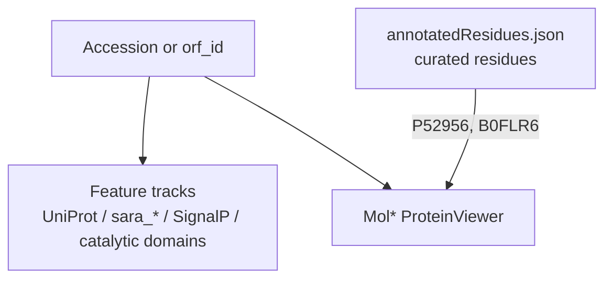

# Sequence and structure viewers

## Goal

Show sequence features and 3D structure on ORF / curated sequence pages the way people expect from InterPro-style tools: zoomable tracks, residue highlights, and a structure tab.

Related: [#54](https://github.com/petadex/igem-toronto/issues/54), [#65](https://github.com/petadex/igem-toronto/issues/65), [#56](https://github.com/petadex/igem-toronto/issues/56).

## What users see

- Feature tracks (Nightingale / Petadex catalytic domains / SignalP when available)
- Structure tab with Mol*; for a few curated accessions, highlighted residues + callouts
- ORF pages can pull domains/motifs/signal from SQL via `/api/sara-viewer` (prototype path)

## How data flows

**Quigley PyMOL reference:** he sent `annotated_reference_sequences.pse` (catalytic residues styled in PyMOL). The site does **not** load the `.pse`. Style and residue picks were turned into `annotatedResidues.json` + Mol* highlights/callouts.

## What I shipped (May–Jun 2026, plus Angela wiring Aug 2026)

1. **Nightingale / sequence UI** — hover, zoom, light/dark, AA highlight.
2. **`/api/sara-viewer`** — domains, motifs, signal by `orf_id`; prototype page with source toggle.
3. **Mol* annotations** — residue highlights on Structure tab; callouts; bulk-select fixes.
4. **Shared catalytic-domains feature viewer** across sequence pages.
5. **Angela SignalP + cluster PID nav** (fork `feat/angela-sequence-annotations`):
   - SignalP6 from `public.signalp6_orf_predictions` on `/sequence/orf/:id`
   - API: `GET /api/orf/:orfId/annotations`
   - PID parent path + pin centroids on `/cluster/:level/:id` (child enumerate deferred)
   - Eng notes: `frontend/docs/angela-sequence-annotations.md`, `angela-followups.md`

## Key files (petadex.io)

- `frontend/src/components/protein/*` (ProteinViewer, AnnotatedProteinViewer, molstar*)
- `frontend/src/components/protein/annotation-reference/annotatedResidues.json`
- `frontend/src/components/proteinViewerPrototype/*`
- `backend/src/routes/saraViewer.js`, ORF annotation routes
- SignalP / cluster UI under sequence + cluster pages

## How to check

- Curated Features / Structure tabs (try accessions with annotation JSON if available).
- ORF sequence page: tracks + structure.
- SignalP: `/sequence/orf/294247546` (known SP hit).
- Cluster nav: `/cluster/90/1124517` (parent path + pin tray).

## Blocked / follow-ups

- Wire new annotation tables as dry lab publishes them (PTMs, DeepLoc, biochem).
- DeepLoc / biochem: soft stubs until DB update + Angela load.
- Ancestral AA: waiting on Thomas running Angela’s scripts.

## Screenshots

- `figures/sequence-features.png`
- `figures/structure-callouts.png`
- `figures/signalp-orf.png`  
  See [figures/README.md](../figures/README.md).
