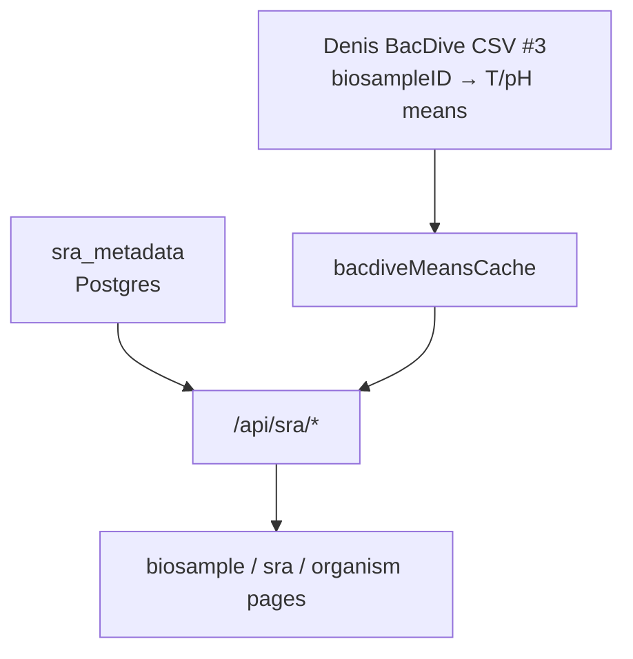

# SRA / BioSample / BacDive hubs

## Goal

Give sample provenance a place on the site: SRA runs, NCBI BioSamples, and organisms from ingested `sra_metadata`, then attach Denis BacDive environmental means when we have a CSV.

Related: [#28](https://github.com/petadex/igem-toronto/issues/28).

## What users see

- Hub pages: `/biosamples`, `/sra/:acc`, `/biosample/:id`, `/organism/:name`
- Deep links from ORF provenance, curated metadata, resolver, cluster organism stats, map popups
- On a BioSample: BacDive optimum T / pH means when CSV #3 is configured

## How data flows

Join for means: **`biosampleID`** ↔ BioSample id. Env: `BACDIVE_MEANS_PATH` or `BACDIVE_MEANS_URL`. Status: `GET /api/sra/bacdive/status`.

## What I shipped (Jul 2026)

Branch: `feat/denis-bacdive-biosample-means` (stacked for a clean rebase).

1. Hubs + API on `sra_metadata`; file-backed organism stats cache for search.
2. Denis CSV #3 wired (`bacdiveMeansCache.js`); example schema in repo; means panel on biosample UI.
3. Eng note: `frontend/docs/sra-biosamples.md`.

## Key files (petadex.io)

- `backend/src/routes/sra.js`
- `backend/src/lib/bacdiveMeansCache.js`, `sraStatsCache.js`
- `frontend/src/pages/biosamples.js`, `biosample/[biosampleId].js`, `organism/[organismName].js`, `sra/[acc].js`
- `frontend/src/components/sra/SraShared.jsx`

## How to check

1. Point `BACDIVE_MEANS_PATH` at a CSV, restart API.
2. `GET /api/sra/bacdive/status` should show loaded.
3. Open a BioSample id that appears in the CSV — means panel should show.

## Blocked

- Denis CSV #1, #2, #2.5 not published yet.
- Production feed URL was private (403); local / env path works for now.

## Screenshot

- `figures/biosample-bacdive-means.png` — see [figures/README.md](../figures/README.md).
